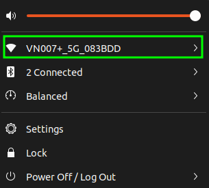

# Ubuntu 系统下配置USB WiFi接收器
- 适用于WiFi设备型号：`0bda:c811`
- 检查设备型号：
    通过`sudo lsusb`查看当前USB设备和对应id，在其中找到网卡设备如下：
    
    - 如果不是同个设备型号，可以复制设备id自行搜索解决方案
- 同款WiFi设备型号的解决方案参考自[这里](https://askubuntu.com/questions/1162974/wireless-usb-adapter-0bdac811-realtek-semiconductor-corp)，步骤如下：
    - 作者的方案是建立一个临时的网络连接，在终端输入如下命令：
    ```shell
    sudo apt update
    sudo apt install build-essential git dkms bc
    git clone https://github.com/brektrou/rtl8821CU.git
    cd rtl8821CU
    chmod +x dkms-install.sh
    sudo ./dkms-install.sh
    ```
    - 在程式执行完成后，接着运行：
    ```shell
    sudo modprobe 8821cu
    ```
    然后在右上角即可发现WiFi的图标出来了，如下图所示：   
    
