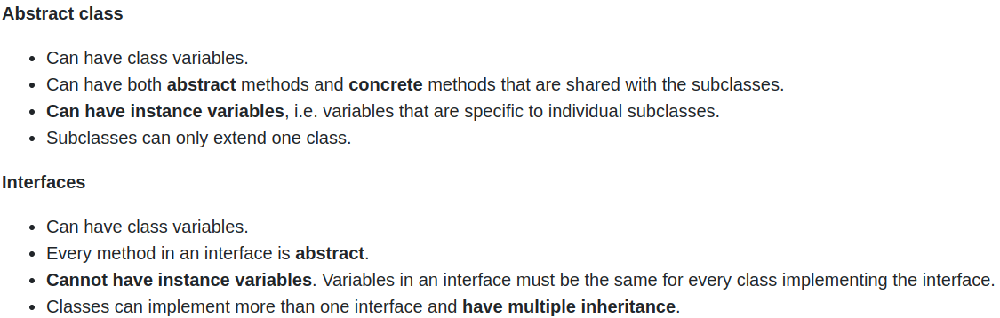

# Installation
- 关于包的说明：
    - `openjdk-18-jre-headless`: jre(Java Runtime Enviroment)只能运行Java环境，不能做开发，而`headless`代表运行没有个GUI的Java Apllication
    - `openjdk-18-jre-lib`: `openjdk-18-jre-headless`依赖于此，安装时会一起安装
    - `openjdk-18-jdk`: jdk(Java Development Kit)即Java开发组件，即能运行又能开发

# Primitive Types
- 8个Primitive types：
    - int, byte, short, long, float, double, boolean, char
- 容易混淆：
    - String, Integer等是object types
    - Object types都是以大写字母开头

# Difference Btw function & methods
- A function is any block of reusable/callable code.
- A method is a block of reusable/callable code that is attached to a class or object.

# Stack vs Heap in memory
- Stack 存储primitives and object **reference**;
- Heap 存储objects **themselves**.

# Polymorphism(多态性)
   - 即一个object可能存在多种状态，例如车(car)即是car本身，又是vehicle(交通工具,plane、boat等也是vehicle) 

# Interface & Abstract class
## Interface
- 我们可以implement多个Interface,例如
    ```java 
    public class Car implements Vehicle, Production ...
    ```
- Interface中定义的methods都是Abstract
## Abstract class
- Abstract class 具备的特性：
    1. 它抽象地定义了subclass的methods，但是我们不能直接通过Abstract class来实例化(Instantiation)
    2. 在Abstrac class中，每个Abstract methods只是类似一个头文件，不会包含其具体implementations；
    3. Extends Abstract class的subclass必须implement 所有abstract method
- Abstract class 只能extends一个(不能像Interface可以implements多个)
## Difference


# Exceptions
- Java的error-handling框架定义两个class来表示abnormal software events：
    - `Error class`：表示严重的问题，
    - `Exception class`: 相比Error较轻的问题
- `Error`和`Exception`都继承自Abstract class`throwable`
- `Exception`:
    - `Unchecked Exception`: Unknown to compiler, only known at runtime, are used when when we expect that the caller of the method cannot recover from the exception
    - `Checked Exception`: known to the compiler
        - If we are calling a method that potentially throws a checked exception, it must be handled (or we will get an error from the compiler)
        - are used when we expect that the caller of the method can recover from the exception
## Exception Handler
- `try {}catch{}`
    - 处理程序抛出的exception,并保证程序能够继续运行下去；
    - 例如:
    ```java
    try {
        System.out.println(new Phone("iPhone", numbers[i]));
    }catch (IllegalArgumentException ex){  // ex等同于设置别名
        System.out.println(ex.getLocalizedMessage()); // 通过getLocalizedMessage()获取Exception内的文本信息
    }
    ```
- `finnaly()`:
    - 在`finnaly(){}` block内的程序会一直执行，即使遇到导致程序终止的Error

# Collection
## Sort 
- 调用`Collections.sort()`进行排序；
- 三种可以进行`sort`的object类型：
    - String
    - Wrapper objects(Wrapper primitive variable into objects, e.g. LinkedList)
    - User-defined classes:
        - 需要implements `Comparable` Interface，其中包含Abstract method: `compareTo` 

# Singleton
- 目的是在项目中确保只有一个Instantiation，实现方法如下：
    ```java
    class Singleton(){
        private static Singleton singleton = null;
        // 确保只有一个实例化，实例化时通过Singleton.getInstance实现
        public static getInstance(){
            if (singleton == null){
                singleton = new Singleton();
            }
            return singleton;
        }
        // 将Constructor转为private
        private Singleton{
            ...
        }
    }
    ```
