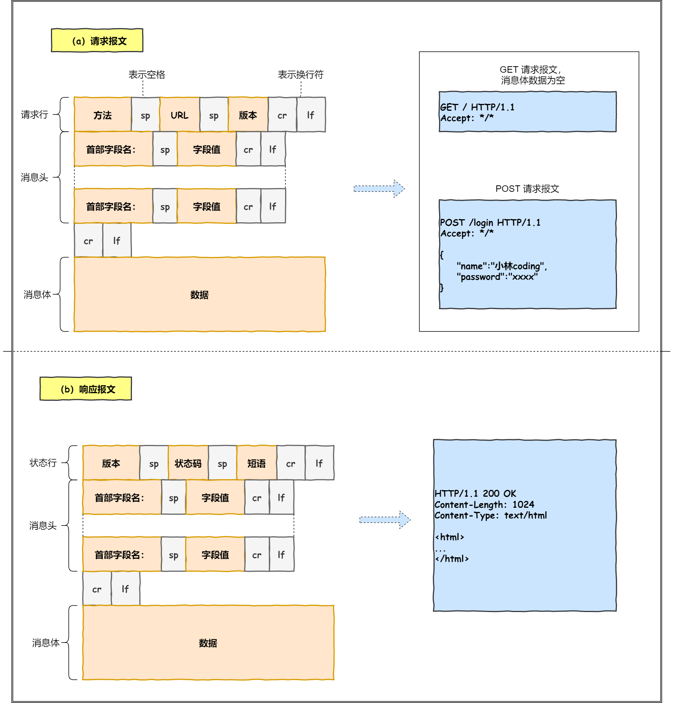
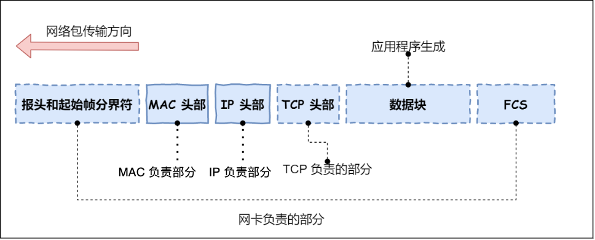
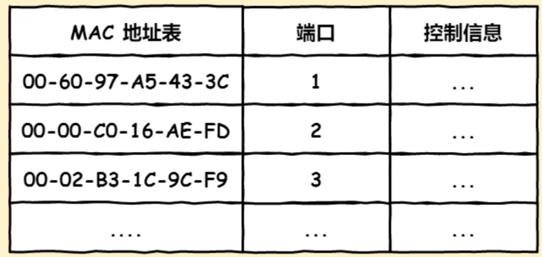
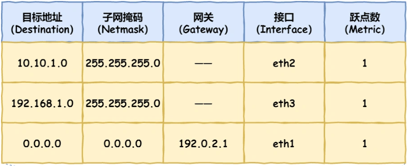

# IP  
## 子网掩码(Netmask)
- 子网掩码用来区分网络号(标识属于哪个子网)和主机号；
- 例如`10.100.122.0/24`，`24`表示子网掩码`255.255.255.0`，`24`代表的是子网掩码的二进制中有**24个1**；
- 子网掩码与IP**按位与运算**得到网络号，**取反**后与IP与运算得到主机号
- 包含的协议：
    - `ICMP` 用于告知网络包传送过程中产生的错误以及各种控制信息。
    - `ARP` 用于根据 IP 地址查询相应的以太网 MAC 地址。

# URL
- URL的解析,如图所示:  
    
- 如果没有指定文件路径，默认访问根目录下的指定文件，例如`/index.html`或`default.html`等
- 请求报文和响应报文格式：
    

# 流程
- 解析URL -> 生成HTTP请求信息 -> DNS解析域名得到IP -> 将HTTP传输任务交给操作系统中的协议栈 -> TCP三次握手建立链接 -> IP定位通信对象 -> 通过MAC进行两点传输 -> 网卡转换为电信号 -> 交换机进行转发 -> 路由器转发 -> 目标设备接收并拆解包

# MAC
## 包头格式
- 接收方MAC地址(32位)
- 发送方MAC地址(32位)
- 协议类型(16位)，在TCP/IP通信中，协议只用：
    - `0800` IP 协议
    - `0806` ARP 协议
- `ARP`协议：通过广播的形式在以太网中找寻对应IP地址设备的MAC地址
    - 操作系统会将`ARP`查询结果存储到ARP缓存空间中
    - 因此查询顺序是：ARP缓存查询->ARP广播查询
- `arp -a`: 查看ARP缓存内容

# 网卡
- 网卡驱动将包放到网卡内的缓存区，并加上以下标识符：

    - 起始帧分界符 用来表示包起始位置的标记
    - FCS（帧校验序列）用来检查包传输过程是否有损坏

# 交换机
- 工作在MAC层，俗称**二层设备**(端口**没有**对应MAC地址)，负责将网络包**原样**地转发到目的地
- 工作流程
    - 和网卡相同的部分
        - 将电信号转换为数字信号，通过`FCS`校验无错则放到缓冲区;
    - 和网卡不同的部分
        - **网卡本身具有MAC地址**，当检测到包中的接收方MAC地址与自身不同时，则将包丢弃；
        - **交换机端口没有MAC地址**，不核对包中的接收方MAC地址，而是都放到缓冲区中
- MAC地址表

    - 例如包的接收方MAC地址与第三行`00-02-B3-1C-9C-F9`匹配，交换机将包发送给端口`3`
- **交换机根据包的接收方MAC地址，查询下一点的MAC地址并进行转发传输**
> MAC表找不到对应MAC地址时？
- 交换机会将包发送给除源端口之外的所有端口，将响应的设备MAC地址写入MAC表中
- 两种广播地址：
    - MAC 地址中的 `FF:FF:FF:FF:FF:FF`
    - IP 地址中的 `255.255.255.255`

# 路由器
- 俗称**三层设备**(端口**都有**MAC地址和IP地址)，
- 和交换机类似的是
    - 会**查表**判断包的转发目标
- 和交换机不同的是
    - 对于不匹配MAC地址的包会进行丢弃
    - 端口有MAC地址，可以成为以太网的接收方和发送方
- 收到的包接收方MAC地址不匹配，则会将包丢弃；若匹配，则将MAC头部丢弃(它的任务完成了)，然后根据MAC头部后的IP头部进行查询和转发

- 匹配完目标地址后，继续查看`Gateway`
    - 如果`Gateway`是一个IP地址，表示包还未到终点，需要继续经过这个IP进行转发
    - 如果为空，表示包已经到终点，IP包中的接收方IP地址即是表内的目标地址

