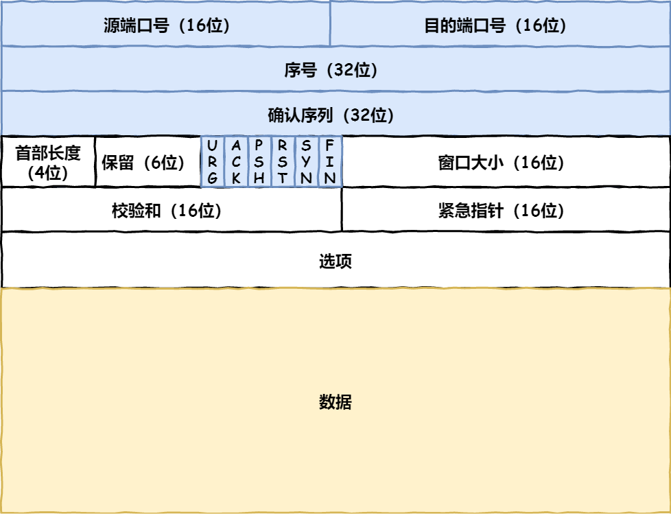
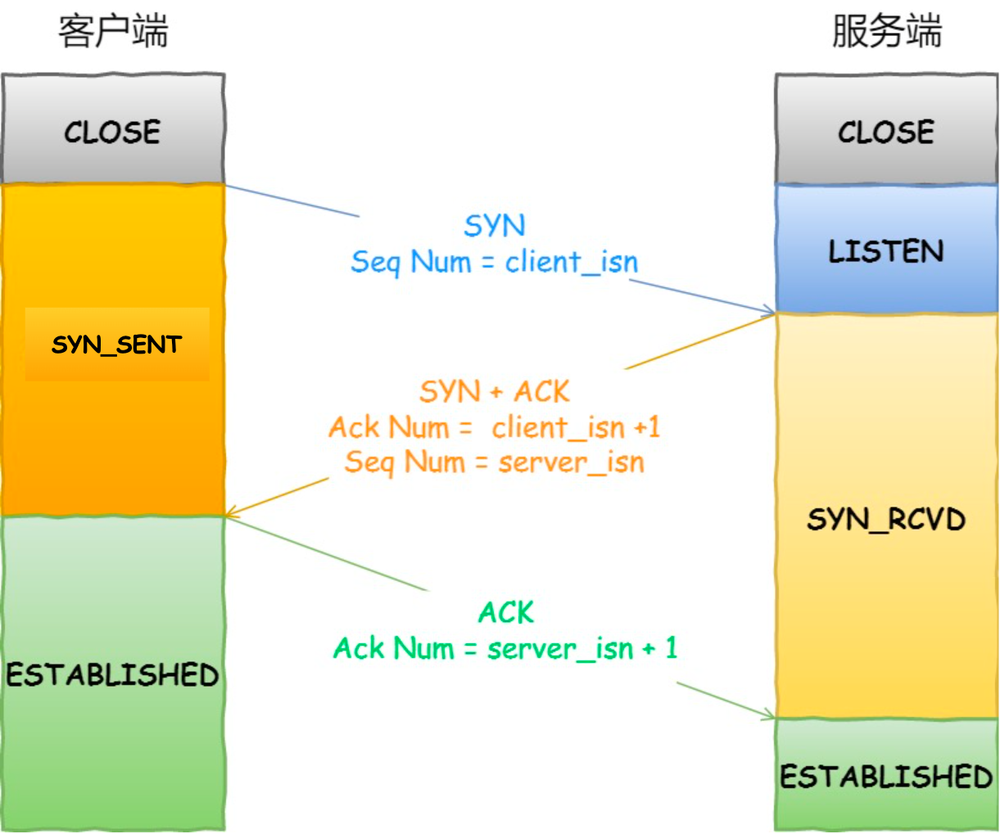
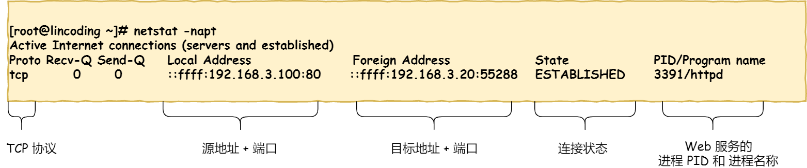
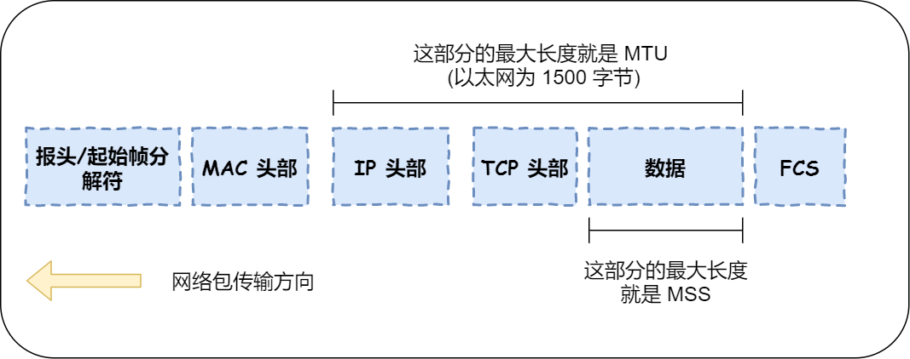
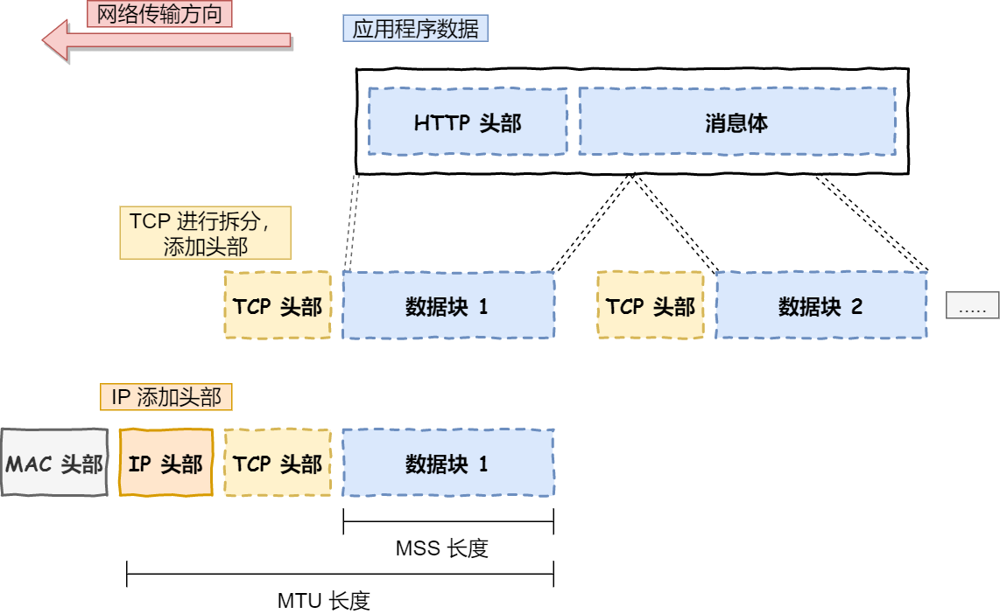

# 报文
## 报头格式

- **序号** 标识包的序号，防止乱序;
- **确认号** 确认对方是否收到，防止丢包；
- 标志位
    - `ACK` 回复标志位;
    - `SYN` 发起链接;
    - `FIN` 结束标志位;
    - `RST` 重新链接
- **窗口大小**(流量控制) 通信双方各声明一个窗口(缓存)大小，代表自己当前的处理能力
- 拥塞控制 拥塞是指通信双方路程上的，TCP可控制自身发送速度

## 三次握手

## 查看TCP链接状态
- `netstat -napt`
    

## TCP分割数据
- 概念：
    - `MTU` 一个网络包最大长度，以太网中一般为`1500`字节
    - `IP`和`TCP`包头一般为20字节
    - `MSS` 除去`IP`和`TCP`，一个TCP数据包能包含的最大长度，一般为`1460=1500-20-20`

- 若HTTP请求消息较长，超出`MSS`范围，TCP需要将其拆分为一个个数据包，而不是一次性发送

# 字节流和报文流
- **UDP是面向报文流**，**TCP是面向字节流**，如何理解呢？
    - 操作系统不会拆分UDP数据报，一个UDP报文就是一个用户的完整消息；同时操作系统接收到UDP报文后会将其推入队列中，通过`recvfrom()`获取，如下图：
    
    - 而操作系统可能会将TCP拆分成多个报文(超出`MSS`)，导致一个报文里可能会有多个用户的消息，因此不能认为一个用户对应一个TCP报文

## 粘包
- 粘包发生在TCP报文中，原因是一个报文中可能存在多个用户的消息，那么如何区分呢？
    - HTTP 协议通过设置回车符、换行符作为 HTTP header 的边界，通过 Content-Length 字段作为 HTTP body 的边界，这两个方式都是为了解决“粘包”的问题
