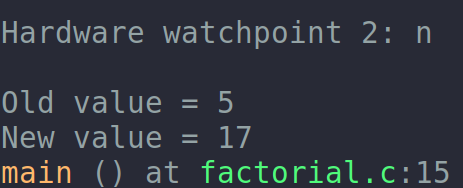

- Compile for debugging:
    `gcc -Wall -g program.c`
- gdb command:
    - `refresh`: 有时界面错乱，可以用`refresh`刷新(快捷键:Ctrl-l)
    - `next(n)` and `step(s)`
        - `next`不会进入函数, `step`会。
    - `continue`: continue to next breakpoint
    - `print`:
        - 查看一个变量的value：`print Variable`
        - 查看一个array：`print *arr@len` (len是要查看的长度)
    - `set args ...`: 设置参数
    - `display expression`: 
        - 执行expression并查看其返回值，之后每次next/step/continue等时都会display一次;
        - 移除display：`delete display <display_number>` (`info display`可以查看相关信息)
    - `watch variable`:
        - 用来监视某个变量值，当发生变化时会在命令行输出结果，例如：  
        
## Examining in the Stack
- 每次程序调用一个函数时，程序会自动生成关于该函数的信息，例如：
    - location of the call;
    - args of the call;
    - local variables of the call;
- 这些信息都保存在一个数据块中，称作`stack frame`, stack frame则分配在内存中一块叫做`call stack`的区域
- command about frame:
    - frame n: n是int，代表frame的level，例如0表示innermost(currently executing)frame，1表示调用0的frame,以此类推，最高的n代表main().

